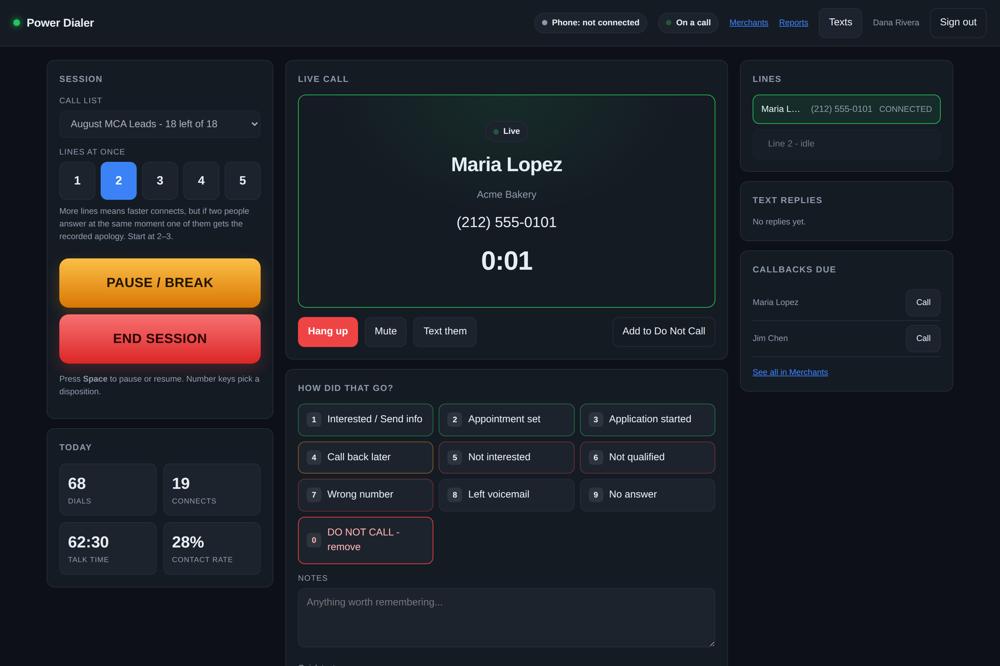
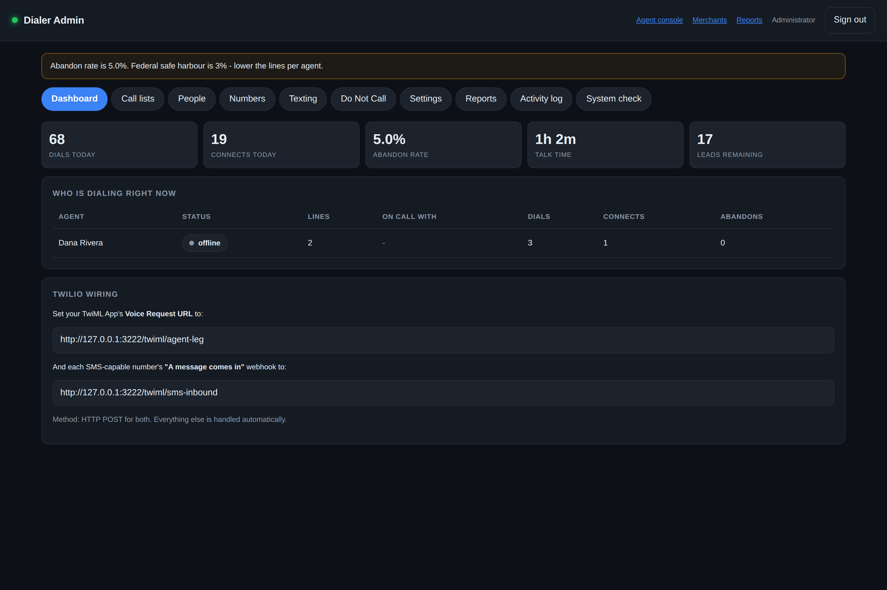
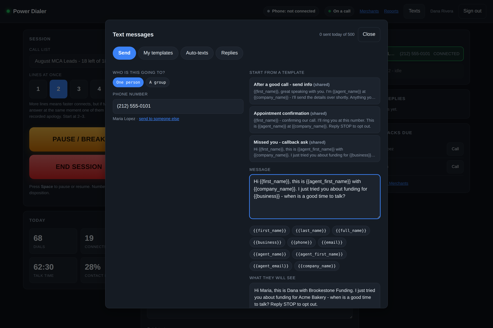
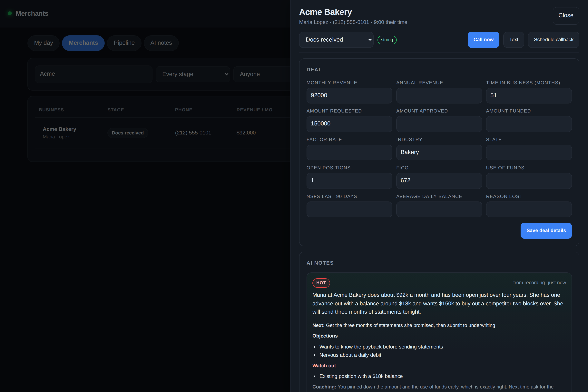
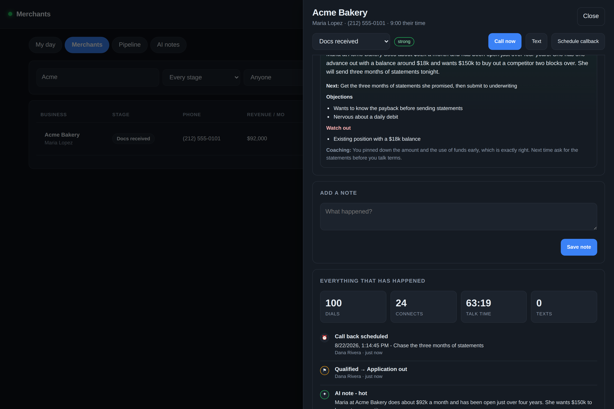
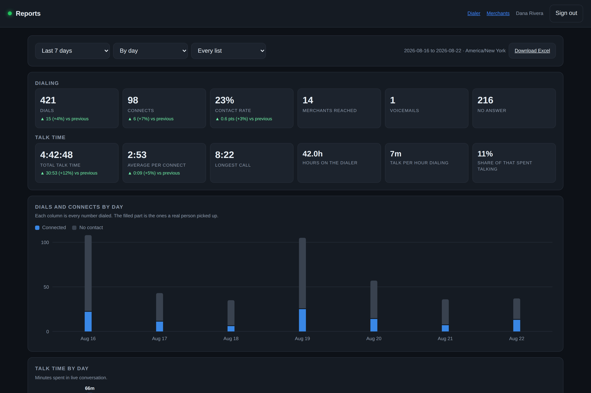
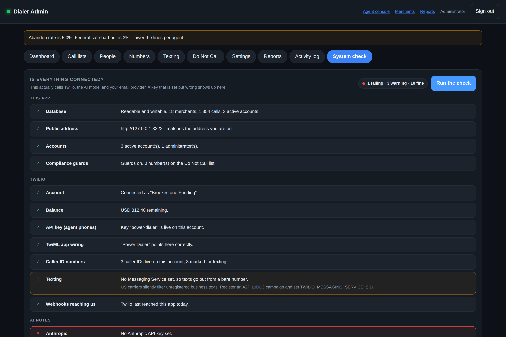

# Power Dialer

A multi-line power dialer for Twilio. Your employees open a web page, pick a
spreadsheet, press one green button, and start talking to people. Up to five
numbers ring at once per agent; the first human to answer lands in the agent's
headset and the rest are dropped mid-ring.

**New here? Read [SETUP.md](SETUP.md).** It is written for a non-developer and
walks the whole thing end to end.





---

## What it does

- **Safe on a shared Twilio account.** Point `TWILIO_SHARED_ACCOUNT=true` at a
  `CALLER_IDS` list and auto-setup will not read or write a single number
  outside it. The key and TwiML app it makes are new resources, never edits to
  yours. Or give it a Twilio subaccount's credentials and the two projects
  cannot see each other at all.
- **Two values to set up.** Give it a Twilio account SID and auth token and it
  does the rest of the Twilio wiring itself — creates its own API key and TwiML
  app, adopts your numbers as caller IDs, and points the webhooks at wherever
  it is currently deployed. It re-checks that on every boot, so a redeploy can
  never leave Twilio aimed at a dead address.
- **One button to start, one to pause, one to stop.** That is the whole agent
  workflow. Space bar pauses and resumes.
- **1-5 simultaneous lines per agent**, adjustable mid-session.
- **Browser softphone** (Twilio Voice JS SDK) — no desk phones, no apps to
  install, works from home.
- **Spreadsheet in, spreadsheet out.** Drop in CSV or Excel, confirm the column
  mapping, dial. Export results with dispositions, notes, talk time and
  recording links.
- **Answering-machine detection** so agents stop landing on voicemail
  greetings.
- **Do Not Call list**, enforced at import time and again before every dial.
- **Calling-hours guard** in the *lead's* timezone, worked out from area code.
- **Abandon-rate guard** — tracks the 3% federal safe harbour and automatically
  trims lines when you drift over it.
- **Local caller ID matching** — a merchant sees a number that looks like their
  neighbour. Exact area code first, then their state, then their timezone, then
  anything. The same merchant keeps seeing the same number on later attempts,
  and within a tier the least recently used number goes next so no single
  number gets worked to death and flagged for it. A coverage panel shows how
  much of your book you can ring locally and which area codes are worth buying
  a number in.
- **Live admin monitor** — who is dialing, who is on a call, connect rates,
  abandon rates, full call log with recordings.
- **Callbacks**, notes, per-agent stats, disposition hotkeys.

### Texting

- **Every agent writes their own templates**, with merge fields that pull from
  the spreadsheet: `{{first_name}}`, `{{business}}`, `{{agent_first_name}}`,
  and any spare column you imported (`{{Requested Amount}}`).
- **Send to one person or a group.** Pick a list, filter it the way an agent
  actually thinks — *people who did not answer*, *people I spoke to*,
  *scheduled callbacks* — tick who gets it, send. Or paste raw numbers.
- **Auto-texts fire on the call outcome**: they answered, they did not answer,
  we hit voicemail, the line was busy, we abandoned, or you picked a specific
  disposition. Optional delay, optional per-list scope, once-per-person guard.
- **Replies come back in.** A lead who texts back lands in the agent's inbox
  with a live notification and a full two-sided thread they can answer from.
- **STOP is handled properly** — the number goes on the opt-out list *and* the
  Do Not Call list, their lead is closed out, and anything still queued for
  them is cancelled.
- **Guards that are on by default**: quiet hours (a text queued at 11pm goes
  out at 8am their time, it is not dropped), an appended opt-out line, a
  per-agent daily cap, and a carrier-friendly drip rate on bulk sends.



### The CRM

Built around how a merchant cash advance desk actually works, not a generic
contact list.

- **A real pipeline**: New lead → Contacted → Qualified → Application out →
  Docs received → Underwriting → Offer out → Funded / Declined / Dead. Dials
  and dispositions move deals along on their own; a stage a human set is never
  walked backwards by automation.
- **The fields that decide a deal**: monthly revenue, time in business, open
  positions, amount requested, FICO, NSFs, industry, state, use of funds,
  approved and funded amounts, factor rate. Imported straight from your
  spreadsheet — `$45k`, `3 years`, `18 months` and `in business since 2019` all
  parse correctly.
- **A qualification read** on every merchant: under $10k/month, under six
  months in business, three or more open positions, FICO under 500, or heavy
  NSFs get flagged before a rep wastes a call.
- **One timeline per merchant** — every dial, text, note, stage move, AI note
  and field change in one column, with who did it and when.
- **Callbacks** with a due time, a rep's day view of what is overdue and what
  is coming, one-click dial from the list, snooze, and a nudge when one comes
  due. A "call back later" disposition books one automatically.



### AI notes on every dial

After a conversation ends, the call is transcribed and Claude writes the CRM
note the rep would have written if they had the time — tuned specifically for
MCA qualifying.

- A short factual summary of what the merchant actually said.
- An interest read: hot / warm / cold / dead / unclear.
- The concrete next step, and the objections they raised in their own words.
- **Extracted deal data** — revenue, time in business, positions, the ask, use
  of funds — written into the blank fields on the merchant record. It only ever
  fills blanks; a number a person typed is never overwritten.
- **Risk flags** an underwriter would care about: stacking, tax liens,
  bankruptcy, restricted industry, or the merchant asking not to be called.
- The callback the merchant asked for, booked automatically.
- One line of coaching for the rep.

The note appears on the agent's screen a few seconds after the call, and on the
merchant record forever. If transcription is unavailable the note is written
from the rep's typed notes instead, and says so.



### Reports

Every employee can run their own numbers — they do not have to ask anyone.

- **Date range** they choose: today, yesterday, this or last week, last 7 or 30
  days, this or last month, or any custom range. Dates are in your business's
  timezone, not UTC, so "yesterday" means what a person means by it.
- **Dialing**: dials, connects, contact rate, merchants reached, voicemails, no
  answers — each with the change against the previous equivalent period.
- **Talk time**: total, average per connect, longest call, hours on the dialer,
  talk minutes per hour dialing, and the share of dialer time actually spent
  talking.
- **Charts**: dials and connects over time (the filled part of each column is
  the people who picked up), talk time over time, how long conversations ran,
  and what the calls turned into.
- **Group by** day, hour of day, call list, disposition — or by person, for
  admins.
- **A team leaderboard** everyone can see, sorted by talk time. Switchable off
  from Admin → Settings if you would rather it were private.
- **Excel download** of any report: summary, the series, dispositions, and every
  individual call.

A rep only ever sees their own numbers — asking the API for someone else's is
ignored, not obeyed. Admins can pull one person or the whole floor.



### Accounts

- **Self sign-up, locked to your email domain.** Employees create their own
  accounts; nobody outside `@yourcompany.com` gets in. Optional admin approval
  queue.
- **Forgot password** with a single-use emailed link that expires.
- **Invites** — an admin enters an email, the person picks their own password.
- Passwords are bcrypt-hashed, reset tokens are stored as SHA-256 hashes, and
  the reset endpoint answers identically whether or not the address exists.

### The admin portal

Everything an owner needs, at `/admin`.

- **People** — promote anyone to administrator or back, change how many lines
  they may dial, disable an account, or remove someone entirely. Removal hands
  their merchants and open callbacks to whoever takes over and keeps every call,
  text and note. Guards stop you demoting yourself, switching off your own
  account, or deleting the last administrator.
- **Per-person view** — click a name for their status, last sign-in, live
  station, today and this week's numbers, their last fifteen calls, their lists,
  open callbacks and recent account activity.
- **Activity log** — who signed in, who failed to, who changed a role, who
  imported or deleted a list, who edited Do Not Call, who changed settings, and
  who downloaded data. Filterable by person and by kind. Kept even after the
  account is deleted.
- **System check** — actually calls Twilio, Anthropic and your email provider
  rather than just checking that a variable is set. It catches the failure
  people really hit: a key that is present but wrong, a TwiML app still pointing
  at an old deployment, a caller ID you no longer own, a Twilio balance about to
  run out mid-shift. Each result comes with the fix in plain English.



---

## How a call actually happens

```
 Agent's browser                Your server                    Twilio
      │                              │                            │
      │ 1. click START               │                            │
      ├─────────────────────────────►│                            │
      │                              │  places the agent's leg    │
      │◄─────── softphone connects ──┼───────────────────────────►│
      │        (parked, silent, in conference "agent-room-7")     │
      │                              │                            │
      │                              │  2. calls.create x3        │
      │                              ├───────────────────────────►│  ring ring ring
      │                              │                            │
      │                              │  3. someone answers        │
      │                              │◄─── POST /twiml/lead-answer│
      │                              │     (AnsweredBy=human)     │
      │                              │                            │
      │                              │  4. TwiML: join conference │
      │                              ├───────────────────────────►│
      │◄══════════ live conversation ════════════════════════════►│
      │                              │                            │
      │                              │  5. cancel the other 2     │
      │                              ├───────────────────────────►│  click, click
```

The agent's conference room persists for the whole session, so the next lead
drops in with no ringing, no dial tone, no delay.

If a second person answers in the same instant, they hit step 3 and find the
agent already taken — they hear the abandon message and go back in the queue.
That is the trade you make for multi-line dialing, and it is why the abandon
rate is tracked so visibly.

---

## Stack

Node 20+, Express, SQLite (better-sqlite3), Socket.IO, Twilio Voice SDK.
No build step, no framework, no external database. One process, one file of
state.

```
src/
  server.js            express app, sessions, auth, static
  config.js            environment -> typed config + setup warnings
  db.js                schema, migrations, seed data
  auth.js              login, roles, middleware
  realtime.js          socket.io fan-out
  twilioClient.js      REST client, access tokens, conference naming
  dialer/engine.js     the actual dialer: stations, bursts, claiming, guards
  sms/messenger.js     templates, merge fields, the send queue, rules, opt-outs
  crm/index.js         merchant record, timeline, pipeline, deal fields
  crm/stages.js        the MCA pipeline and the qualification screen
  crm/tasks.js         callbacks, follow-ups, the rep's day
  ai/notes.js          the MCA-tuned prompt, the note worker, field extraction
  ai/transcribe.js     Twilio Voice Intelligence / Deepgram / Whisper adapters
  reports/index.js     date ranges, dialing and talk-time queries, leaderboard
  email/mailer.js      Resend / SendGrid / SMTP, reset and invite templates
  admin/health.js      the connection checks behind the System check screen
  setup/provision.js   creates and re-points the Twilio side on every boot
  audit.js             the who-did-what trail
  routes/
    api.js             agent API
    admin.js           admin API (upload, people, numbers, DNC, reports)
    crm.js             merchants, pipeline, timeline, tasks, AI notes
    reports.js         report API, permissions, Excel export
    twiml.js           TwiML Twilio requests, inbound SMS
    webhooks.js        call status, AMD, recording, conference, SMS receipts
  dialer/callerId.js   local caller ID matching, rotation, coverage
  util/
    phone.js           E.164 normalisation, validation, area-code timezones
    areacodes.js       every NANP area code mapped to its state or province
    spreadsheet.js     CSV/XLSX parsing, MCA column detection, export
public/
  login.html  signup.html  forgot.html  reset.html
  agent.html  crm.html  reports.html  admin.html
  css/app.css  js/agent.js  js/crm.js  js/reports.js  js/admin.js  js/texting.js
tests/
  smoke.test.js        151 end-to-end tests against a faked Twilio and a faked model
```

---

## Running locally

```bash
cp .env.example .env     # account SID + auth token is enough
npm install
npm start                # http://localhost:3000
npm test                 # 151 tests, no Twilio or Anthropic account needed
```

For local development you need a public HTTPS tunnel so Twilio can reach you:

```bash
ngrok http 3000
# then set PUBLIC_URL=https://<your-id>.ngrok-free.app and restart
```

---

## Important operational notes

- **Run one instance.** Lead locking and station state live in the process.
  Two instances behind a load balancer will double-dial. If you outgrow one
  process, move lead claiming to Postgres with `SELECT ... FOR UPDATE SKIP
  LOCKED` and put station state in Redis.
- **Roughly 30-40 concurrent agents** on a $7 Render instance before you should
  think about scaling. The bottleneck is Twilio webhook throughput, not CPU.
- **Back up `data/dialer.db`.** It is your entire CRM.
- **Restarts are safe mid-session.** Leads locked by a crashed session are
  released automatically after 10 minutes, and on boot.

## Legal

Predictive/multi-line dialing is regulated. Read the "Before you dial the
first number" section of [SETUP.md](SETUP.md). The 3% abandon guard, the
calling-hours guard and the DNC list are on by default for a reason.
